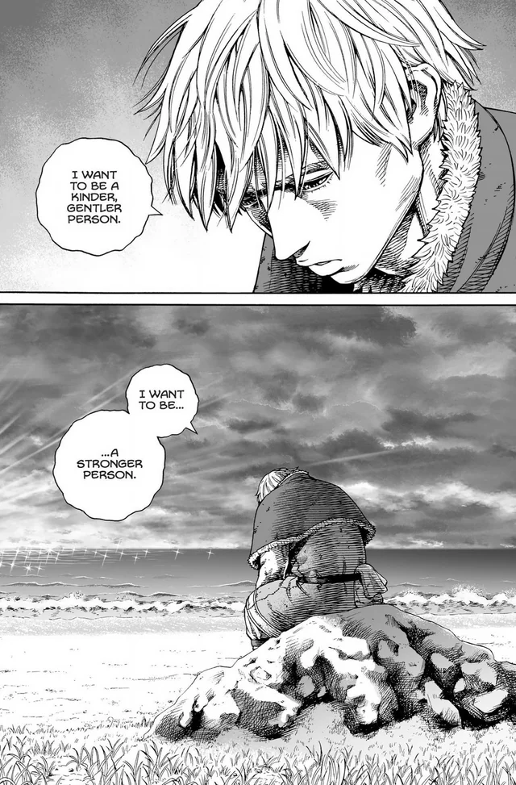

I'm a final-year BS CS student (aspiring for Ph.D.) at the [**<ins>Lahore University of Management and Sciences</ins>**](https://lums.edu.pk/). My research interests span the domains of Networked Systems, and I am particularly drawn to the challenges of constructing efficient, scalable, and secure network systems within diverse distributed applications, each presenting its unique set of constraints and tradeoffs.  To this end, I also intend to rethink many already-existing abstractions that allow us to isolate these problems because, sometimes, the abstractions we synthesize can limit our perspective and discourage unconventional, innovative ways of thinking. 

Currently, under the supervision of my supervisor, [Dr. Zafar Ayyub Qazi](https://web.lums.edu.pk/~zafar/), and an external collaborator, [Dr. Fawad Ahmed](https://fawadahm.github.io/), an acquaintance and I are working on [**<ins>MultiEdge-SLAM</ins>**](https://drive.google.com/file/d/1CXw79VaWWb37qIpXT1azWWtVcRv34AQe/view), which initially began as a course project. The objective is to extend [**<ins>Edge-SLAM</ins>**](https://dl.acm.org/doi/10.1145/3561972) (built on ORB-SLAM2) for Multi-Access Edge Computing via pre-emptive state migration, empowering smartphones with limited computational capabilities to participate in SLAM algorithms, thereby enabling emerging AR/VR 5G applications. 

In my Junior year, I also joined in as a co-author on an extended submission for [**<ins>CellClone</ins>**](https://dl.acm.org/doi/10.1145/3555050.3569130), a successor to [**<ins>Neutrino</ins>**](https://dl.acm.org/doi/10.1145/3387514.3406218) that addressed its shortcomings regarding fault tolerance. Supervised by [Mukhtiar Ahmed](https://mukhtiarahmad.com/), I led a key aspect of the expansion, which involves reimagining Control Plane Functions (CPFs) to achieve a more ecologically valid distribution of edge sites and evaluating accordingly. Through this evaluation, I 
demonstrated the tradeoff between latency and fault tolerance that network operators can optimize for their constraints. 

<section id="publications">
<h3><b>Publications</b></h3>

<ul>
  <li>
  <b><u>CellClone: Accelerating 5G Applications with Active Control Plane Clones at the Edge</u></b>: 
  Mukhtiar Ahmad, Muhammad Ali Nawazish, Muhammad Taimoor Tariq, <ins>Muhammad Ahmed</ins>, Muhammad Basit Iqbal Awan, Muhammad Taqi Raza, and Zafar Ayyub Qazi (Under review in IEEE/ACM Transactions on Networking)
  </li>
</ul>
</section>

<section id="teaching">
<h3><b>Teaching Experience</b></h3>

<ul>
  <li>
    <b>Undergraduate Head Teaching Assistant, LUMS</b>
      <ul>
        <li> CS 582: Distributed Systems (Fall 2023) </li>
      </ul>
  </li>
  <li>
    <b>Undergraduate Teaching Assistant, LUMS</b>
      <ul>
        <li> CS 382: Network-Centric Computing (Spring 2023) </li>
        <li> CS 202: Data Structures (Fall 2022)  </li>
      </ul>
  </li>
</ul>
</section>

<section id="awards">
<h3><b>Awards</b></h3>

<ul>
  <li>Dean's Honor List (2020-2023)</li>
</ul>
</section>

<section id="blog">
<h3><b>Blog</b></h3>

<ul>
  <li>As a Head TA, I conducted an <a href="https://drive.google.com/file/d/19CHkVWhDBWm8XZg6Ce6USx9QkLeP62Xx/view">asyncrhonous comprehensive session on Paxos</a> in CS:582 (Distributed Systems) where I reviewed some practice problems</li>
  <li>For MultiEdge-SLAM, one of my contributions was tracing out the entire KeyFrame generation pipeline over <a href="../assets/pdf/KeyFrame_notes.pdf" target="_blank">an eight-page document</a>, an exercise that proved to be pivotal in both coding and debugging our schemes.</li>
  <li>Led my <a href="https://medium.com/@muhammadahmed3691/netflix-analyzing-and-predicting-movie-ratings-233e61197a04">CS:334 (Data Science) project</a> where we analyzed a Netflix movie dataset and developed an ML model to predict movie ratings based on preliminary information such as synopsis, title, director, genre. </li>
  <li>Served as the <a href="https://docs.google.com/presentation/d/1TFID9XzVrFLFrToGws5kRwKOP6-2lG3P/edit?usp=sharing&ouid=108165828665607373786&rtpof=true&sd=true">Graphic Designer for Team Teardrop</a>, which secured 1st place in th COVID-19 Hackathon 2020 by Open Data Pakistan. Most notably, I crafted the team's logo and final presentation.</li>
</ul>
</section>

<h3><b>Miscellaneous</b></h3>

<ul>
  <li>A very helpful <a href="https://www.cs.cmu.edu/~harchol/gradschooltalk.pdf">resource</a> for graduate school applications that greatly aided me in my graduate applications.</li>
  <li>Some <a href="https://ihsan-qazi.blogspot.com/2010/08/few-pieces-of-advice-i-gave-to-my.html">old yet golden wisdom</a> from one of my mentors, Dr. Ihsan Ayyub Qazi, that I resolve to keep in mind going forward! </li>
  <li>A very eloquent <a href="https://www.linkedin.com/posts/isaiahhankel_jobsearch-careerdevelopment-careers-activity-7127656296102707200-pV_Y?utm_source=share&utm_medium=member_desktop">LinkedIn post</a> that best captures my motivations for a Ph.D.</li>
  <li>I'm a staunch fan of J-Pop music, and I've been vibing to <a href="https://www.youtube.com/watch?v=GHcMFjmPPS0&ab_channel=StarryAya">Social Path</a> (by Stray Kids and LiSA, two stellar performers in their own right) lately!</li>
  <li>One of the best, yet hilarious <a href="https://www.youtube.com/watch?v=Vw3hbaZcn6I&ab_channel=MuhammedAhmed">VALORANT clips</a> I've hit back in the day xD</li>
  <li><a href="https://www.youtube.com/watch?v=8egHozM7ABQ&ab_channel=MuhammedAhmed">Here's me</a> initially dominating, but eventually getting humbled by Malenia, one of the hardest bosses in video gaming history from Elden Ring, one of the best RPGs of all time.</li>
  <li>An <a href="https://www.youtube.com/watch?v=h3R650Kx5vk&t=2s&ab_channel=iiitsubasa">ASMV (Anime Story Music Video)</a> on Thorfinn from Vinland Saga - a breathtaking story of vengeance superseded by redemption (don't forget to turn on English subtitles >.>)! Here's also my most memorable manga panel of him:</li>
  
</ul>